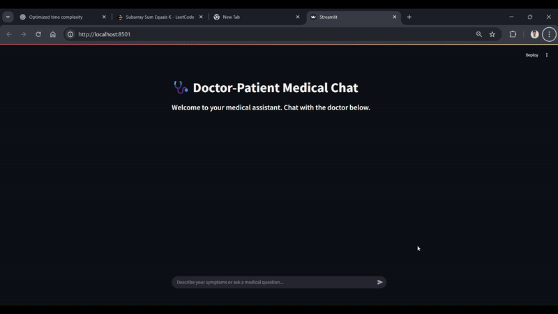

# LightRAG-Powered Medical Chatbot

Our **medical chatbot** is an AI-driven, retrieval-augmented assistant designed to provide **evidence-grounded**, **context-aware medical answer**s. It integrates a **LightRAG** pipeline with **ChromaDB** for **hybrid vector and graph storag**e, enabling efficient and accurate retrieval of relevant medical knowledge. By leveraging **SentenceTransformer** embeddings for semantic understanding and a powerful LLM for answer generation, the system overcomes the limitations of standalone language models, achieving **83% response accuracy**.

This approach combines graph and vector retrieval with modern LLM generation to deliver reliable, contextually accurate responses. The chatbot also features an intuitive **Streamlit** interface, making it accessible for users seeking trustworthy healthcare guidance. Overall, this project demonstrates how retrieval-augmented AI systems can enhance the reliability and usability of medical conversational agents.

>  **Disclaimer:** This chatbot is intended **for educational and informational purposes only**. It is **NOT** a substitute for professional medical advice, diagnosis, or treatment. Always consult a licensed healthcare provider for medical concerns.

---
## demo Video

  

  
##  Key Features

- **Hybrid Retrieval (Graph + Vector)** via LightRAG for more accurate, grounded answers  
- **Semantic Understanding** using SentenceTransformer embeddings  
- **ChromaDB Integration** for fast vector similarity + relational knowledge lookups  
- **Medical Query Handling** with ~83% retrieval-grounded accuracy (based on internal evaluation)  
- **Interactive Streamlit UI** for Q&A, guidance-style answers, and context inspection  
- **Modular RAG Pipeline** (ingestion → indexing → retrieval → answer synthesis)  
- **Hallucination Mitigation** via context filtering + answer provenance display  


```
.
├─ RAG_DataBase/              # (Persisted Chroma / vector store or DB artifacts)
├─ images/                    # Static images (used in documentation / UI)
├─ lib/                       # Supporting library code (place shared modules here)
├─ .gitignore
├─ RAG_evalution.ipynb        # Jupyter notebook (NOTE: 'evaluation' misspelled)
├─ README.md
├─ chunking.py                # Document chunking utilities
├─ demo.gif                   # Animated demo of the app
├─ graph_visible.py           # Script to build or visualize knowledge graph (outputs HTML)
├─ insert_doc.py              # Ingest documents into vector / graph storage
├─ knowledge_graph.html       # Generated interactive graph (output artifact)
├─ light_RAG.py               # Core RAG pipeline (retrieval + generation)
├─ medical_Assistance.py      # Chat / Streamlit (or CLI) interface for user Q&A
├─ medical_book.txt           # Source medical corpus (sample knowledge base)
└─ requirements.txt
```


## High-Level Workflow

1. Prepare or update medical source text (`medical_book.txt` or additional documents).
2. Run chunking (`chunking.py`) to produce manageable text segments.
3. Ingest chunks and build / update vector (and optional graph) storage via `insert_doc.py`.
4. (Optional) Generate / update a knowledge graph (`graph_visible.py` → `knowledge_graph.html`).
5. Serve the assistant (`medical_Assistance.py`) which internally calls retrieval logic (from `light_RAG.py`).
6. User asks a question → relevant chunks retrieved → LLM synthesizes grounded answer.
7. Evaluate retrieval / answer quality using the notebook.

---


##  Run the Assistant

If `medical_Assistance.py` uses Streamlit:
```bash
streamlit run medical_Assistance.py
```


##  Evaluation

Open the notebook:


Developed by **Rishab Kushwaha**  
GitHub: [Rishabh9559](https://github.com/Rishabh9559)

